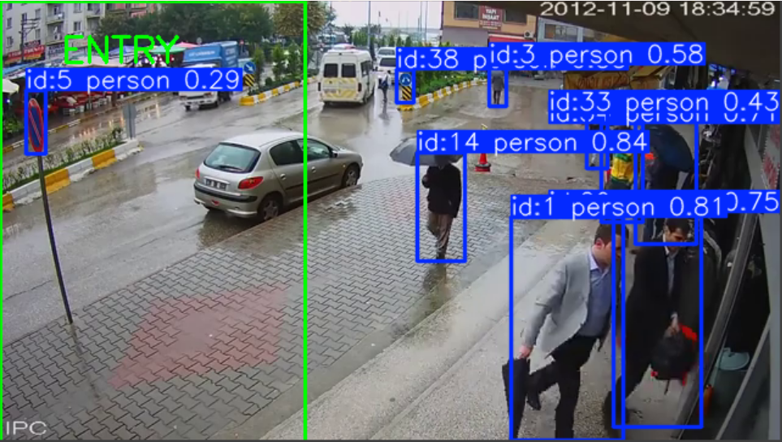

# Store Intelligence System

## Overview

Store Intelligence System is an AI-powered retail analytics platform developed for the Purplle Tech Challenge 2026. The platform transforms raw CCTV footage into actionable business intelligence using computer vision, multi-object tracking, event-driven analytics, and real-time dashboards.

By combining visitor detection, behavioral analytics, queue monitoring, and conversion tracking, the system enables retailers to understand customer journeys inside physical stores with the same level of visibility available in modern e-commerce platforms.

---

## Problem Statement

Retail businesses have mature online analytics systems that track every click, session, and purchase. However, physical stores often operate with limited visibility into customer behavior and operational performance.

The objective of this project is to bridge that gap by analyzing CCTV footage to generate meaningful retail insights such as:

* Visitor footfall and occupancy
* Entry and exit analytics
* Customer dwell time across store zones
* Queue monitoring and abandonment detection
* Store conversion rate analysis
* Customer movement and funnel tracking
* Real-time anomaly detection

These insights are exposed through REST APIs and interactive dashboards, enabling data-driven decision making for store operations and customer experience optimization.

---

## Solution Highlights

* AI-based person detection and tracking
* Visitor session identification
* Zone-wise behavioral analytics
* Event-driven architecture
* Real-time metrics and reporting
* Conversion funnel analysis
* Queue depth monitoring
* Anomaly detection engine
* FastAPI-powered backend services
* Interactive Streamlit dashboard
* Dockerized deployment for easy setup

---

## Business Impact

The platform helps retailers measure and improve their most important offline metric:

**Offline Store Conversion Rate = Purchasing Visitors ÷ Total Visitors**

By transforming CCTV footage into structured events and actionable analytics, the system enables better staffing decisions, improved customer experience, optimized store layouts, and increased sales conversion.

## Features
# Screenshots

## Swagger API Documentation


---

## Store Intelligence Dashboard


---

## Detection & Tracking Pipeline




### Computer Vision Pipeline

* YOLOv8 person detection
* ByteTrack multi-object tracking
* Persistent visitor IDs
* Zone-based intelligence

### Event Streaming

* ENTRY events
* ZONE_ENTER events
* ZONE_EXIT events
* Dwell time analytics
* JSONL event stream

### Analytics Engine

* Visitor counting
* Zone analytics
* Funnel conversion analytics
* Dwell time metrics
* Anomaly detection

### Production APIs

* FastAPI backend
* Swagger documentation
* Health monitoring
* Metrics APIs
* Funnel APIs
* Anomaly APIs

### Dashboard

* Streamlit analytics dashboard
* Real-time metrics visualization
* Zone analytics charts

### Infrastructure

* Dockerized deployment
* Reproducible environment
* Production-style architecture

---

# System Architecture

CCTV Video
→ YOLOv8 Detection
→ ByteTrack Tracking
→ Event Engine
→ JSONL Event Stream
→ FastAPI Backend
→ Metrics Engine
→ Dashboard & APIs

---

# APIs

## Health API

GET /health

## Metrics API

GET /metrics

## Funnel API

GET /funnel

## Anomaly API

GET /anomalies

## Event Ingestion API

POST /events/ingest

---

# Run Locally

## Install Dependencies

```bash
pip install -r infra/requirements.txt
```

## Start Backend

```bash
uvicorn app.main:app --reload
```

## Start Dashboard

```bash
streamlit run dashboard/app.py
```

---

# Docker Deployment

```bash
cd infra
docker compose up --build
```

---

# Technologies Used

* Python
* FastAPI
* Streamlit
* YOLOv8
* ByteTrack
* OpenCV
* Docker

---

# Future Improvements

* Kafka event streaming
* Redis caching
* PostgreSQL persistence
* Re-identification embeddings
* Multi-camera fusion
* Queue prediction models
* Real-time WebSocket streaming

---

# Author

Built for Purplle Tech Challenge 2026
